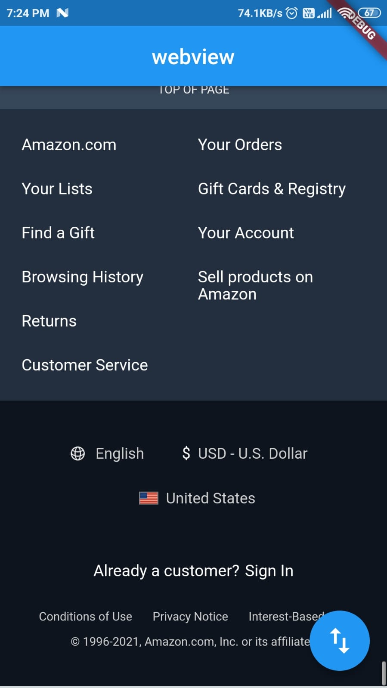

# flutterwebview

A new Flutter project.

## Getting Started

This project is a starting point for a Flutter application.

A few resources to get you started if this is your first Flutter project:

- [Lab: Write your first Flutter app](https://flutter.dev/docs/get-started/codelab)
- [Cookbook: Useful Flutter samples](https://flutter.dev/docs/cookbook)

For help getting started with Flutter, view our
[online documentation](https://flutter.dev/docs), which offers tutorials,
samples, guidance on mobile development, and a full API reference.
"# webviewWithOtherFunctionality"  

Project Details: 
i) flutter webview with website preview: 
&nbsp;&nbsp;&nbsp;&nbsp;a) Header: 
&nbsp;&nbsp;&nbsp;&nbsp;b) Body: 
&nbsp;&nbsp;&nbsp;&nbsp;c) Footer: 

 

ii) Loading another url(youtube) when clicks on floating-Action-Button. 
 

iii)Another functinality i.e. Javascript inject: hiding header and footer of website when click on floating-action-button: 
 

# webview_flutter
